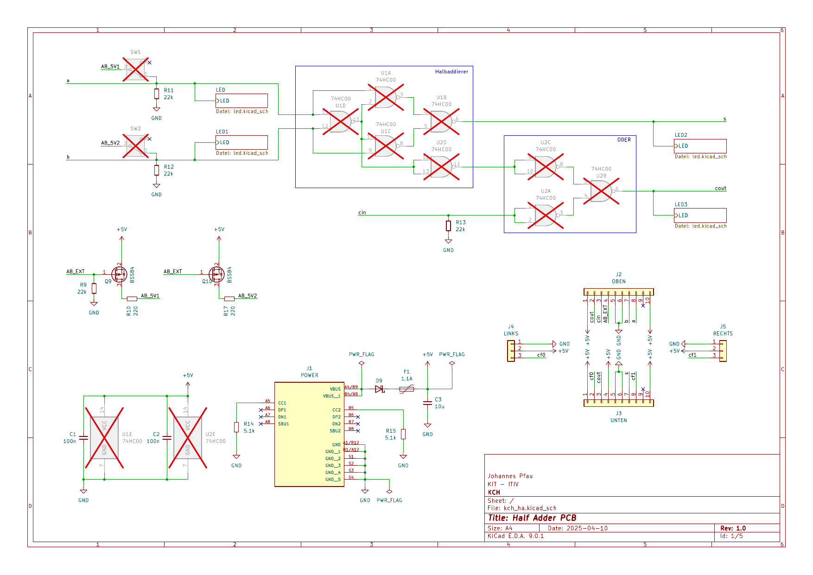

# KCH Half Adder PCB

This repository contains schematic, layout and BOM for the KCH half adder PCB.
The PCB realizes a half adder using NAND gates, where some of the on-board components are left to be soldered by students as an exercise.

Multiple PCBs can be connected to each other to form full adders or multi-bit carry ripple adders.
In addition to the PCB, we provide detailed documentation explaining the theory involved for both the PCB design and the digital circuit realization.

As the intended target audience is school students and their teachers, documentation is currently only available in German.

## Ordering the PCBs

The initial batch of boards we have successfully used in a workshop has been ordered using JLCPCB's standard assembly service.
We had all the parts assembled, except for the switches and the 74HC00 ICs that are marked as do-not-place in the schematic.
Because of that, both-sided assembly and THT assembly is required.
The files we used to order from JLCPCB can be found in the production folder.

Please note: As the connectors are overlapping, the assembly service needs to add some spacers when paneling the design. Either panel yourself or let the factory know about this requirement.

Please also note that the boards should align when connected together.
PCB edges therefore need to be smooth so mouse bites should not be used.
Make sure to use v-score / v-cut panels instead.

## More Information and Documentation

* Project Website and Documentation: [kch.dev/ha](https://kch.dev/ha)
* Project Schematic: [kch_ha.pdf](kch_ha.pdf)
